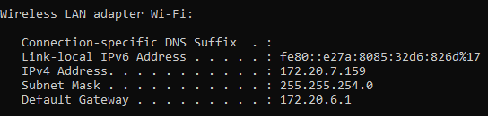
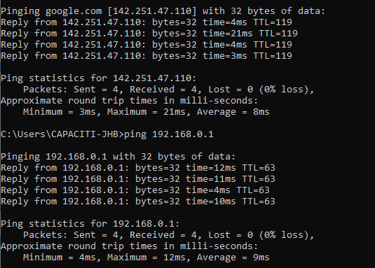
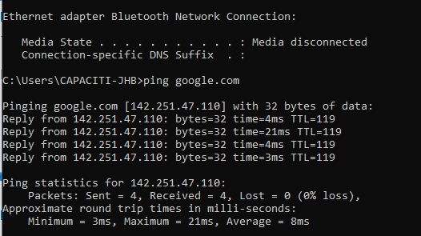
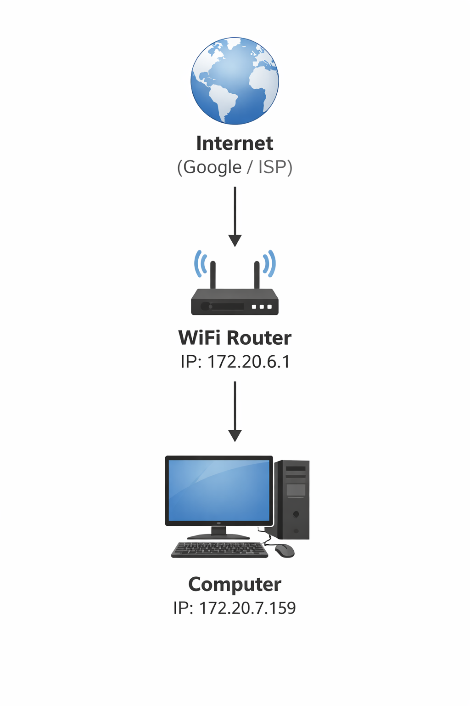

# Network-Mapping-Project

# Name: Galaletsang Maureen Mokgele  

## Project: Network Mapping and Ping Test Project  

---

## Introduction

This project demonstrates my understanding of basic networking concepts. I used the `ipconfig` command to view my computer’s IP address, subnet mask, and default gateway, and the `ping` command to test connectivity between my computer, the router, and the internet. I also created a network diagram to visually represent how the devices are connected.  

The project shows how devices communicate within a network and verifies network connectivity.

---

## Step 1: IP Configuration

Command used:

ipconfig

Network information obtained:

- **IPv4 Address:** 172.20.7.159  

- **Subnet Mask:** 255.255.254.0  

- **Default Gateway:** 172.20.6.1  

This confirms my computer is properly connected to the network.

**Screenshot:**

---

## Step 2: Ping Test to Router

Command used:

ping 172.20.6.1

Result: 4 packets sent, 4 received, 0% loss.  

This confirms successful communication with the router.

**Screenshot:**

---

## Step 3: Ping Test to Google

Command used:

ping google.com

Result: 4 packets sent, 4 received, 0% loss.  

This confirms my computer can access the internet.

**Screenshot:**

---

## Step 4: Network Diagram

The diagram below shows how my computer connects to the router and the internet.

**Screenshot:**

---

## Conclusion and What I Learned

Through this project, I learned how to:

- Use the `ipconfig` command to view network configuration  

- Identify IPv4 address, subnet mask, and default gateway  

- Use the `ping` command to test connectivity to the router and internet  

- Verify network and internet connectivity  

- Create a network diagram to visualize connections  

This project improved my understanding of basic networking, troubleshooting network issues, and documenting network information professionally.
